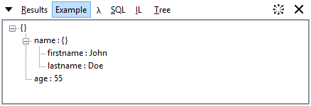
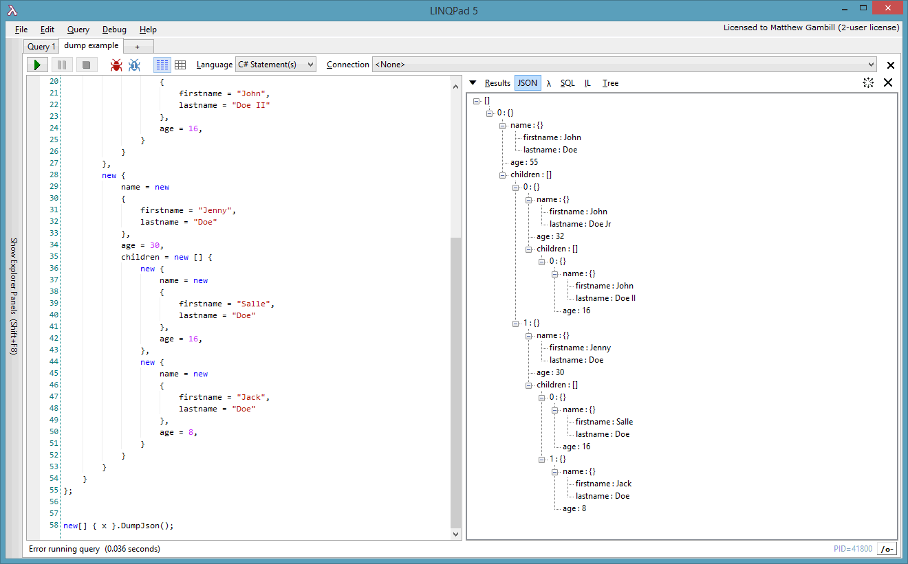

# Json Visualizer for LINQPad

## Install
via [NuGet](https://www.nuget.org/packages/NMyVision.LinqPad.JsonVisualizer):
```
PM> NMyVision.LinqPad.JsonVisualizer
```

Supports both LinqPad 5 and LinqPad 6

## Usage
Dump results to a JSON tree with collapse and expand features.

```csharp
var x = new
{
  name = new
  {
    firstname = "John",
    lastname = "Doe"
  },
  age = 55
};

x.DumpJson();
```

Produces the following output:




To view JSON results plan call static `NMyVision.JsonVisualizer.DumpJson(item)` method or
call `DumpJson` extension method on any object instance. You will also need to add `NMyVision.LinqPad.JsonVisualizer` 
to namespaces list (use F4 to open the dialog). If you want to name the window pass a title as a second parameter.

JSON visualizer with a more complex output:


## License
[MIT](LICENSE)
